## Topic

On this section we will start learning some Intermediate Javascript concept, this is just the continuation of the previous section.

## Keywords && Notes

## Random Number Generation

```
let n = Math.random()
```

This `Math.random()` function creates a random number, with 16 decimal places, from `0 to 0.9999999999999999`, it will not reach to 1.


If you want to create a random number withing a certain range, for example between 1 - 6, what you are required to do is to allow the function to generate a random number then multiply it with 6 and add 1.


> Challange
> Write a program which will prompt a user to enter two names of love partners, then the program will return the message showing the percentage of their love.

```
//My try
let firstName = prompt('Enter your first Name')
let partnerName = prompt('Enter the name of your partner')

const genLovePercent = ()=> {
  let random = Math.floor(Math.random() * 100) + 1
  return `The love percentage between ${firstName} and ${partnerName} is ${random}%`

}

console.log(genLovePercent())

//Expected output: The love percentage between Joseph and Hagari is 95%
```

## Control Statement using IfElse Conditional & Logic

In this section we will learn about `Control flow`, which is the way to control the flow of the code, depending on the current condition.

For example is train tracker is open, go straight, but if it is closed, use the alternative root.
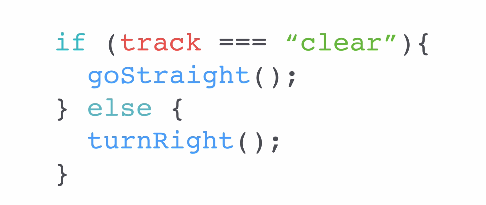

> Challenge
> Improve the code of the previous love challenge, if their love percentage is greater than 70, return the statement saying `Your love score is loveScore%, You love each other like kanye love kanye` else return `Your love score is lovescore%`

```
//My try on this
let firstName = prompt('Enter your first Name')
let partnerName = prompt('Enter the name of your partner')

const genLovePercent = ()=> {
  let loveScore = Math.floor(Math.random() * 100) + 1

  if(loveScore > 70){
   return `The love percentage between ${firstName} and ${partnerName} is ${loveScore}%, you love each other like kanye love kanye`
  }else{
   return `The love percentage between ${firstName} and ${partnerName} is ${loveScore}%`
  }


}

console.log(genLovePercent())


//Expected output: The love percentage between Peter and Anna is 97%, you love each other like kanye love kanye
```

## Comparators and Equality

`Comparators and Equality` are sign which help in checking the equality of values,

```
=== Is equal to
!== Is not equal to
> Is greater than
< Is lesser than
>= Is greater or equal to
<= Is lesser or equal to
```

The difference between `==` and `===` is that , the triple equal sign check for equality of type and values.

```
let a = 1;
let b = "1"
typeof(a)
typeof(b)
//Expected output:
number
string
```

```
let a = 1;
let b = "1"

if(a===b){
console.log('yes')
}else{
console.log('no')
}
//Expected output: no
```

```
let a = 1;
let b = "1"

if(a===b){
console.log('yes')
}else{
console.log('no')
}
//Expected output: yes
```

## Combining Comparators

In this section we will learn on how to combine different comparators to make a control flow. We can achieve this by using `&&` which stand for `AND`, `||` which stand for `OR` and `!` which stand for `NOT`.

> Challenge
> Improve the previous program, write a program which will change the liveScore when it is greater than 70, loveScore > 30 && liveScore <= 70, and loveScore <=30

```
//My try on this
let firstName = prompt('Enter your first Name')
let partnerName = prompt('Enter the name of your partner')

const genLovePercent = ()=> {
  let loveScore = Math.floor(Math.random() * 100) + 1

  if(loveScore > 70){
   return `The love percentage between ${firstName} and ${partnerName} is ${loveScore}%, you love each other like kanye love kanye`
  }
  if(loveScore > 30 && loveScore <= 70){
    return `The love percentage between ${firstName} and ${partnerName} is ${loveScore}%`

  }
  if(loveScore <= 30){
     return `The love percentage between ${firstName} and ${partnerName} is ${loveScore}%, you go together like oil and water`
  }
}

console.log(genLovePercent())

//Expected output: The love percentage between Joseph and Anneth is 60%
```

## Leap Year Challenge

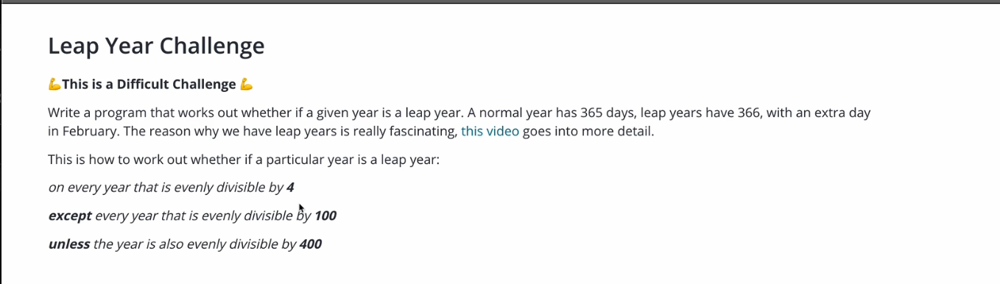

```
//My try on the Challenge
const isLeap = function (year){

  if(year%4===0){
    if(year%100===0){
      if(year%400===0){
        return `${year} is leap year`

      }else{
         return `${year} is not leap year`
      }

    }else{
        return `${year} is leap year`

    }

  }else{
     return `${year} is not leap year`
  }

}


console.log(isLeap(2016))
console.log(isLeap(2020))
console.log(isLeap(2024))


console.log(isLeap(2100))
console.log(isLeap(2200))


console.log(isLeap(2000))
console.log(isLeap(2400))

//Expected output:

2016 is leap year
2020 is leap year
2024 is leap year
2100 is not leap year
2200 is not leap year
2000 is leap year
2400 is leap year
```

## Collections Working with Javascript Arrays

`Array` is way of storing collections of related items in the same container.

```
//Creating an Array
let guestList = ['Joseph','Anneth','Peter']

//Retrieving element in an array, [0] position
guestList[0]

//Using Array function on an array, return boolean
guestList.includes('Joseph')

```

> Challenge
> Create a program array with list of guest, prompt the user to enter their name, a program with check if the name is in the list, then return `Welcome` or `Your name is not in the list`

```
//my try
let nameUser = prompt('Enter your name for verfication').toLowerCase()

let guestList = ['joseph', 'anneth', 'peter']

if(guestList.includes(nameUser)){
  console.log(`Welcome, ${nameUser}`)
}else{
  console.log(`Sorry ${nameUser}, not on the guest list`)
}
```

## Adding Elements and Intermediate Array Techniques

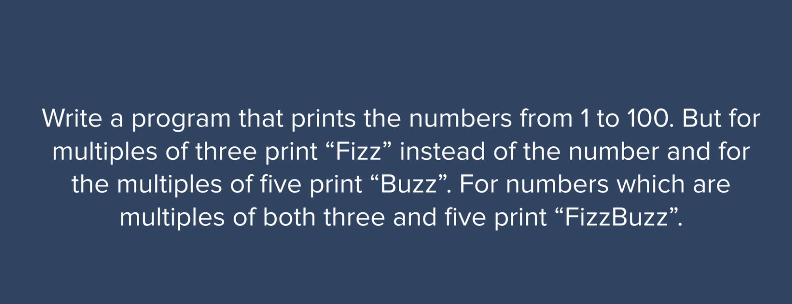

```
//my try
let output = []

function FizzBuzz(){
  let i = 1
  while(i<=100){

    if((i%3 === 0) && (i%5 === 0)){
       output.push('FizzBuzz')
    }else if(i%3 === 0){
      output.push('Fizz')
    }else if(i%5 === 0){
       output.push('Buzz')
    }else{
       output.push(i)
    }


    i++
  }
  console.log(output)
}


FizzBuzz()

//Expected output
[1, 2, 'Fizz', 4, 'Buzz', 'Fizz', 7, 8, 'Fizz', 'Buzz', 11, 'Fizz', 13, 14, 'FizzBuzz', 16, 17, 'Fizz', 19, 'Buzz', 'Fizz', 22, 23, 'Fizz', 'Buzz', 26, 'Fizz', 28, 29, 'FizzBuzz', 31, 32, 'Fizz', 34, 'Buzz', 'Fizz', 37, 38, 'Fizz', 'Buzz', 41, 'Fizz', 43, 44, 'FizzBuzz', 46, 47, 'Fizz', 49, 'Buzz', 'Fizz', 52, 53, 'Fizz', 'Buzz', 56, 'Fizz', 58, 59, 'FizzBuzz', 61, 62, 'Fizz', 64, 'Buzz', 'Fizz', 67, 68, 'Fizz', 'Buzz', 71, 'Fizz', 73, 74, 'FizzBuzz', 76, 77, 'Fizz', 79, 'Buzz', 'Fizz', 82, 83, 'Fizz', 'Buzz', 86, 'Fizz', 88, 89, 'FizzBuzz', 91, 92, 'Fizz', 94, 'Buzz', 'Fizz', 97, 98, 'Fizz', 'Buzz']
```

> Tips
> The order of if statements matters a lot, so it is very important to make such you order the if statement very well.

## Who's Buying Lunch? Code Challenge

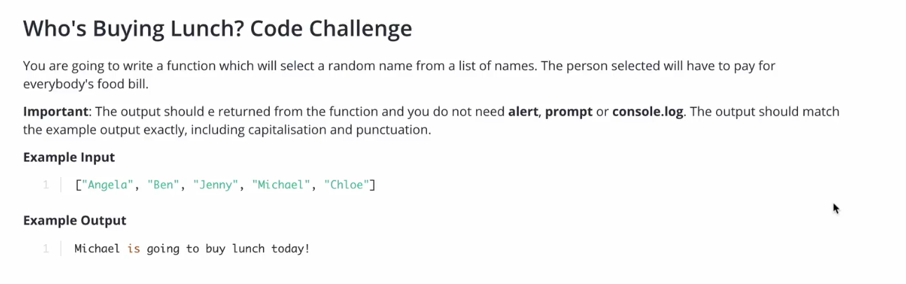

```
//My try
const buyingLunch = (arrayPeople) =>{
  //make a random number with arrayPeople length
  let randomNumber = Math.floor(Math.random() * arrayPeople.length);
  //Use the randomNumber to pick a name from the array

  return `${arrayPeople[randomNumber]} is going to buy lunch today`;
}

//Calling a function
buyingLunch(['Angela','Ben','Jenny','Michael','Chloe'])

//Expected output: 'Chloe is going to buy lunch today'
```

## Control Statement While Loops

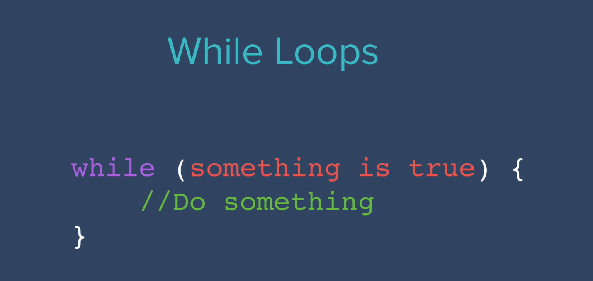
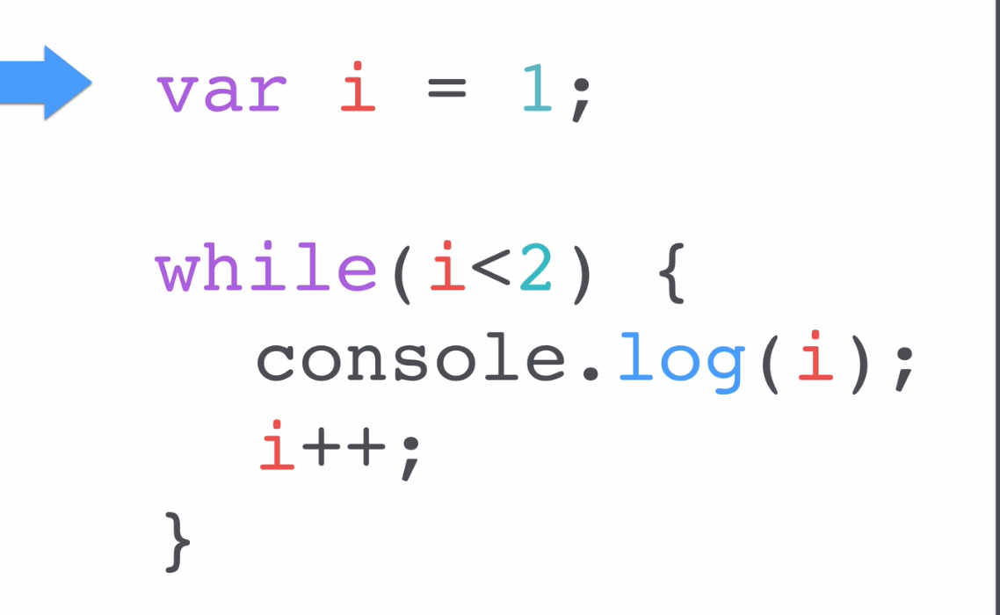

### Challenge `Lyric of the Song 99 Bottles of Beer`

Write a program which will print the following
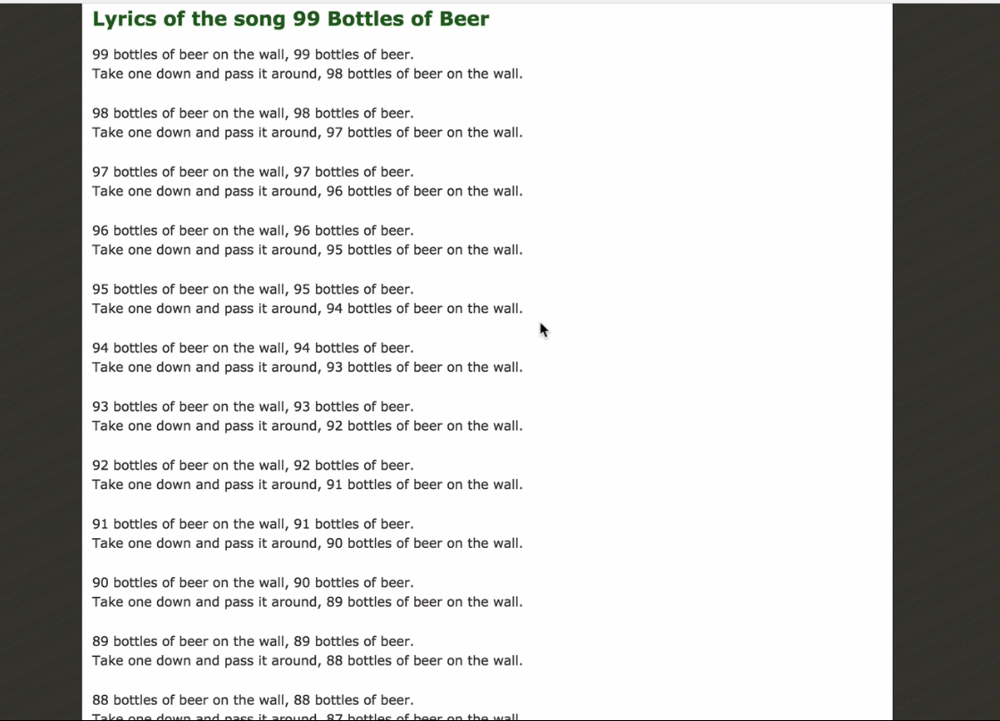

```
//my try
const bottlesBeer = function (numberBeerBootles){
  let i = numberBeerBootles
while(i >=1){
  i == 1 ? console.log(`${i} bottle of beer on the wall, ${i} bottle of bear.\n Take one down and pass it around, mo more bottles of beear on the wall. \n\n`)
  : console.log(`${i} bottles of beer on the wall, ${i} bottles of bear.\n Take one down and pass it around, ${i} bottles on the wall. \n\n`);
  i--
}

console.log(`No more bottles of beer on the wall, no more bottles of beer.\n Go to the store and buy some more, ${numberBeerBootles-1} bootles of beer on the wall`)

}


bottlesBeer(200);
```

## For Loops

Another way we may complete the challenge is by using the `For Loops`, it works similarly like `while loop`


```
let output = []
const fuzzBuzz = (ouput)=>{
    for(let i = 1; i<=10; i++){
        if((i%3 === 0) && (i%5 === 0)){
       output.push('FizzBuzz')
    }else if(i%3 === 0){
      output.push('Fizz')
    }else if(i%5 === 0){
       output.push('Buzz')
    }else{
       output.push(i)
    }
}
       return output
}

console.log(fuzzBuzz(output))

Expected output:
[1, 2, 'Fizz', 4, 'Buzz', 'Fizz', 7, 8, 'Fizz', 'Buzz']
```

`When to use a while loop and when to use the For loop`. Keep in mind that `while loop` check for state, keep repeating a loop untill a state checked is not true.

`For loop` we are iterating, you want to use the for loop to run a piece of code many times, and you use a for loop to define how many times you want to run a piece of code.

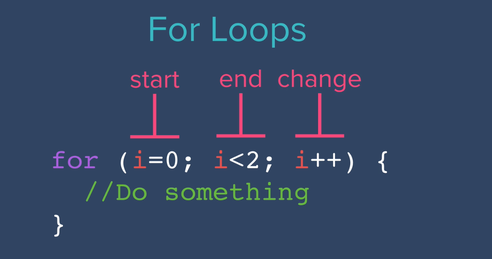

## Fibonacci Challenge

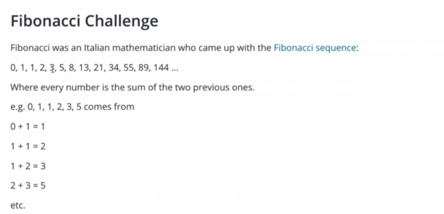
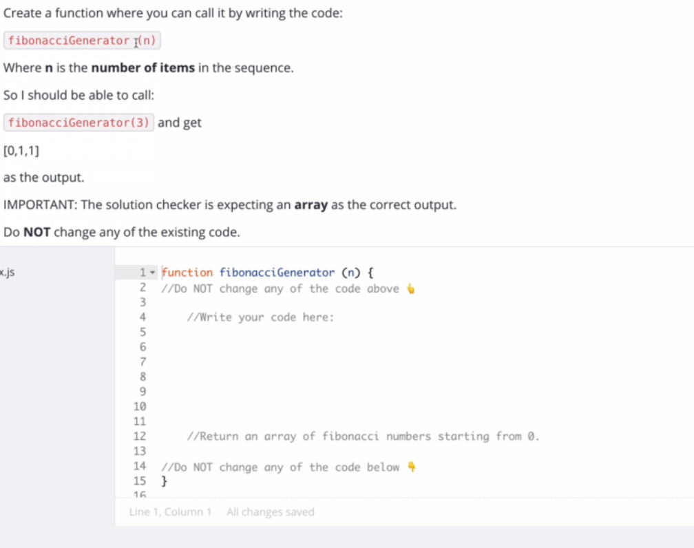
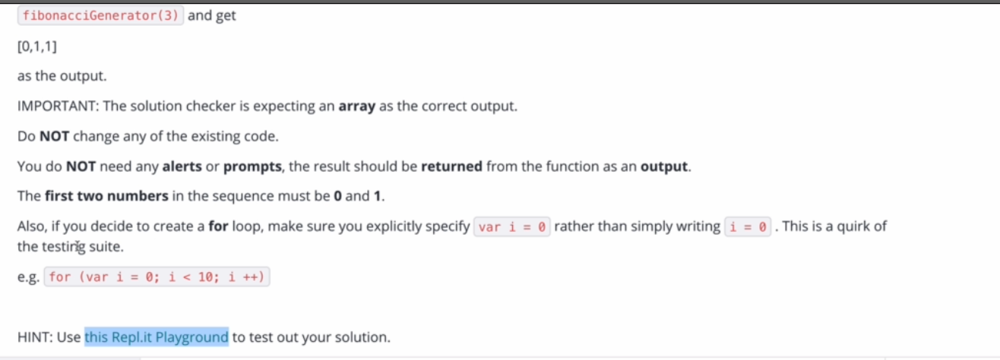

