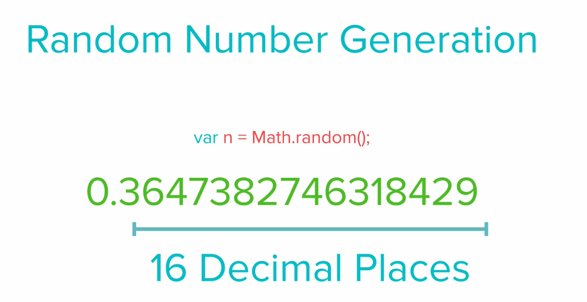
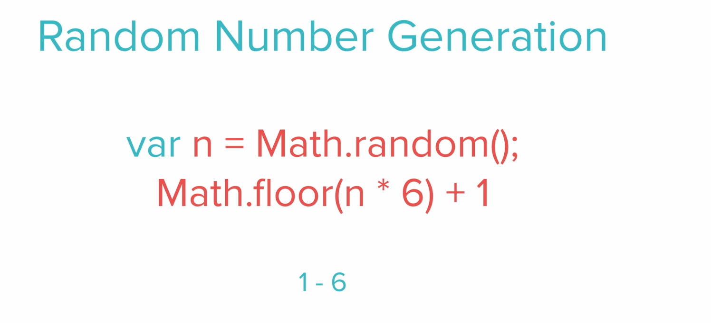

## Topic 
On this section we will start learning some Intermediate Javascript concept, this is just the continuation of the previous section.

## Keywords && Notes
## Random Number Generation
```
let n = Math.random() 
```
This `Math.random()` function creates a random number, with 16 decimal places, from `0 to 0.9999999999999999`, it will not  reach to 1.


If you want to create a random number withing a certain range, for example between 1 - 6, what you are required to do is to allow the function to generate a random number then multiply it with 6 and add 1.


> Challange 
Write a program which will prompt a user to enter two names of love partners, then the program will return the message showing the percentage of their love.

```
//My try
let firstName = prompt('Enter your first Name')
let partnerName = prompt('Enter the name of your partner')

const genLovePercent = ()=> {
  let random = Math.floor(Math.random() * 100) + 1
  return `The love percentage between ${firstName} and ${partnerName} is ${random}%`
  
}

console.log(genLovePercent())
```


## Summary