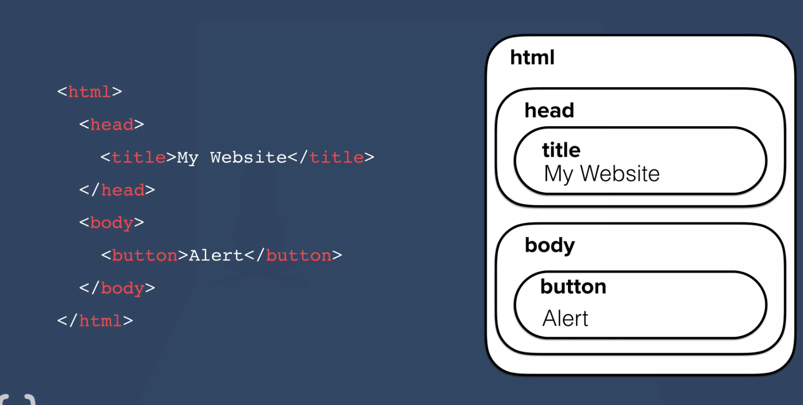
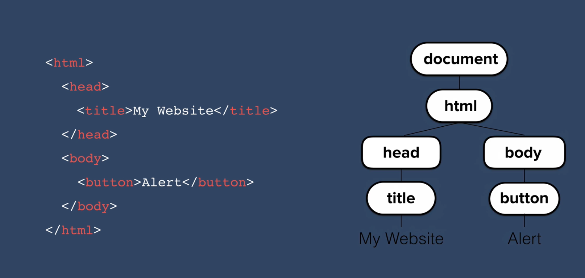
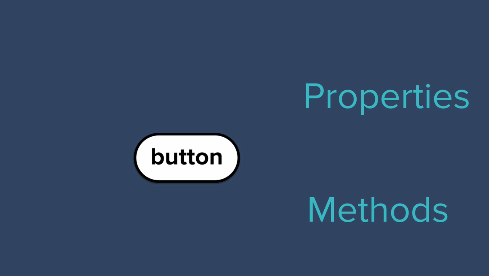

## Topic

On this section we are going to applying some of the lessons that we have learnt about Javascript. We will also learn about DOM (Document Object MOdel).

Also how to incorporate Javascript into HTML.

## Keywords && Notes

## Adding Javascript to Website

This is our HTML Page

```
<!DOCTYPE html>
<html lang="en">
<head>
    <meta charset="UTF-8">
    <meta http-equiv="X-UA-Compatible" content="IE=edge">
    <meta name="viewport" content="width=device-width, initial-scale=1.0">
    <title>My Website</title>
    <link rel="stylesheet" href="style.css">
</head>
<body>
    <h1>Hello</h1>

</body>
</html>
```

In CSS module, we learn different ways which we can add CSS to HTML Page, which we learn that there are three ways which you can use to add CSS to HTML Page, which are `inline`, `internal` and `external`.

Javascript works very similarly, you can add `inline`, `internal` and `external` js.

```
//inline Js: added on HTML tags
//index.html
<body onload = "alert('Hello')">
    <h1>Hello</h1>

</body>

//When the page loads, create an alert "Hello"
```

`Disadvantage of inline Javascript`: It is difficult to debug and it is not a good practice. Try to avoid if you can.

```
//Internal Js : can be added using script tag

//index.html
 <script type="text/javascript">
        alert('Hello')
</script>
```

```
/**
*External JS: can be added as an external file, so *create an external js file then link it to you *HTML Page
*/

//index.html
<script src="index.js"></script>

//index.js
alert("External JS");
```

`Position where we put our js code matters a greate deal`: With CSS we tend to put the CSS link in the head, so that it can be loaded first before any other code is loaded. `if you but JS script tag` at the bottom of the body, after everything has been loaded, then that it fine. But if you but it at the header, then something wrong will happen.

```
//index.js

<!DOCTYPE html>
<html lang="en">
  <head>
    <meta charset="UTF-8" />
    <meta http-equiv="X-UA-Compatible" content="IE=edge" />
    <meta name="viewport" content="width=device-width, initial-scale=1.0" />
    <title>My Website</title>
    <link rel="stylesheet" href="style.css" />
    <script src="index.js"></script>
  </head>
  <body>
    <h1>Hello</h1>
  </body>
</html>

//index.js
document.querySelector("h1").innerHTML = "Good bye";


//Error
index.js:1 Uncaught TypeError: Cannot set properties of null (setting 'innerHTML')
    at index.js:1:40

```

This means we are finding something which is not there (or it doesn't exit). So always make sure you but the `JS script tag` at the bottom of body tag, that ensure all the element have been loaded, then you can use Js to manipulate or access the exiting elements.

## Introduction of the DOM

In order to make website interactive we have to have ability to change part of the website in the fly.

The DOM (Document Object Model), the problem that it's solving is it `divide/catalogue the webpage into individual elements that we can modify and manipulate`

The task of converting the HTML page into the DOM is done by the `browser`, it turns all the HTML page element and there associate data into a tree structure.




```
//index.js
<body>

    <h1>Hello</h1>
    <input type="checkbox" />

    <button style=":active:color:red;">Click Me</button>

    <ul>
      <li class="list"><a href="https://www.google.com"></a> Google </li>
      <li class="list">Second</li>
      <li class="list">Third</li>
    </ul>

    <script src="index.js"></script>
  </body>
```

[HTML Tree Generator Extension](https://chrome.google.com/webstore/detail/html-tree-generator/dlbbmhhaadfnbbdnjalilhdakfmiffeg) - it helps visualize how the browser convert HTML code to DOM tree

If you write `document:` into a console, you will see the entire HTML file.

```
> document.firstElementChild - first element which is [html]

> document.firstElementChild.firstElementChild - first element child of the first element child which is [head]

> document.firstElementChild.lastElementChild which is the [body]

> document.firstElementChild.lastElementChild.firstElementChild which is [h1]


/**
*So once you have find the element then you can *manipulate it.
*/

let heading = document.firstElementChild.lastElementChild.firstElementChild;
heading.innnerHTML = 'Good Bye'

//change color of the element
heading.style.color = 'red'

//look on the entire document an input element
document.querySelector('input).click();

//heading -> [h1]

```

So you can see an element inside the DOM they can have `properties` and `Methods`


```
//For example
//Car object can have properties and methods

//Properties
//get Property
car.color; //red

//set Property
car.numberOfDors = 0;

//Methods
//Call Methods
car.drive();
```

The only difference between the `Methods` and the `Properties` is the `methods` is something that the object can do. Note the methods have parenthesis at the end, while the properties they don't have that.

`Challenge` find the last element of the unordered list(ul) then change it's content to your name or any name, you must do that on the console.

```
//My try
document.querySelector('ul').lastElementChild.innerHTML = 'Schooling'
```

## Selecting HTML Elements with Javascript
This section we will learn how to element using javascript.

```
/*looks on the web page and search
* element with the specified tag name,
* it will get all the elements with that tag name
* note: getElement(s)ByTagName()
*/
> document.getElementsByTagName('li').style.color = 'purple'

```