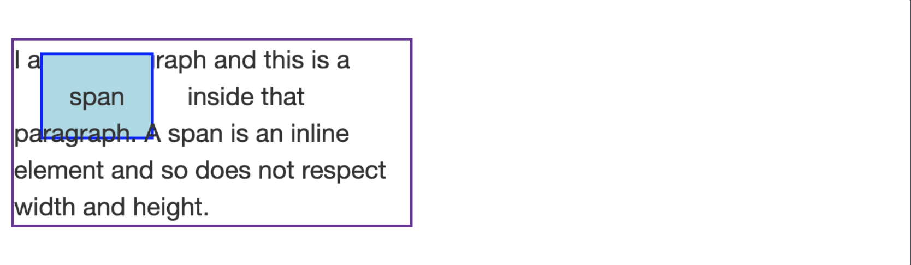
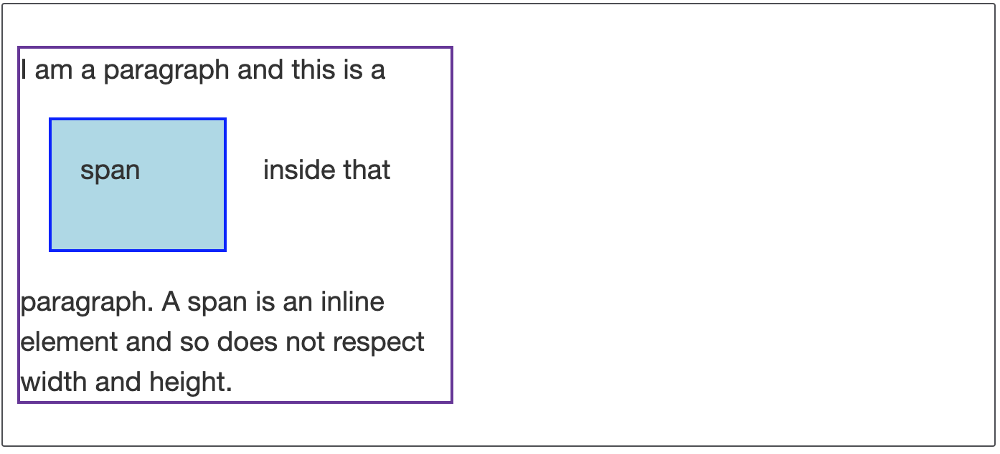

## Intermediate CSS
In this section the main topic is intermediate CSS, the following are topics discussed.

- Favicon
- HTML Divs
- The Box Model of Websites Styling
- CSS Display Property
- CSS Static and Relative Positioning
- Absolute Positioning
- The Dark Art of Centering Elements with CSS
- Font Styling
- CSS Sizing
- CSS Font Properties
- CSS Float and Clear

## Keywords & Notes

### [Favicon](https://developer.mozilla.org/en-US/docs/Glossary/Favicon)
A `favicon` (favorite icon) is a tiny icon included along with a website, which is displayed in places like the browser's address bar, `page tabs` and bookmarks menu. Note, however, that most modern browsers replaced the favicon from the address bar by an image indicating whether or not the website is using HTTPS.

Usually, a favicon is 16 x 16 pixels in size and stored in the GIF, PNG, or ICO file format.
[Favicon Generator](https://www.favicon.cc/)

They are used to improve `user experience` and enforce brand consistency. When a familiar icon is seen in the browser's address bar, for example, it helps users know they are in the right place.

How to link Favicon to html page `rel=icon`
```
<link rel="icon" href="img/favicon.ico">
```
### [display](https://developer.mozilla.org/en-US/docs/Web/CSS/display)
The `display` *CSS property* sets whether an element is treated as a `block` or `inline` element and the layout used for its children, such as `flow layout`, `grid or flex`.

`Block` *elements* will typically `stack vertically` whereas `inline elements` will line up `horizontally`.`Common Block Elements` are `<h1>-<h6>,<div>,(<ol>,<ul>,and<li>),<form>`.`Common inline Elements` are `<span>`,``,`<a>`

Two `Divs` will `stack` *on top of each other*, but if you `set` them to `display:inline`, they will be `next to each` other *horizontally*. `Vise-versa` with Span tags.

* `display:block` makes the element behave like a `block` eg: <p>
* `display:inline` make and element layout `inline`.
* `display:none` will make the element disappear, like it has never been there, `visibility: hidden`; will hide it only, making it kind like transparent and it will `disturb content flow`


### [`<div>`: The Content Division element](https://developer.mozilla.org/en-US/docs/Web/HTML/Element/div)
`Content Division Element`
The `<div>` *HTML* element is the generic container for flow content. It has no effect on the content or layout until styled in some way using `CSS` (e.g. styling is directly applied to it, or some kind of layout model like `Flexbox` is applied to its parent element).
```
div class="shadowbox">
  <p>Here's a very interesting note displayed in a
  lovely shadowed box.</p>
</div>
```

### [`<span>`](https://developer.mozilla.org/en-US/docs/Web/HTML/Element/span)

The `<span>` *HTML* element is a generic inline container for phrasing content, which does not inherently `represent anything`. It can be used to `group elements` for `styling purposes` (using the `class` or `id` attributes),. It should be used only when `no` other `semantic element` is appropriate. `<span>` is very much like a `<div>` element, but `<div>` is a `block-level element` whereas a `<span>` is an `inline element`.

`CSS`
```
li span {
  background: gold;
 }
```
```
<li><span>
    <a href="portfolio.html" target="_blank">See my portfolio</a>
</span></li>
```

### [The box model](https://developer.mozilla.org/en-US/docs/Learn/CSS/Building_blocks/The_box_model)

Everything in `CSS` has a box around it, and understanding these boxes is key to being able to create layouts with `CSS`, or to align items with other items. In this lesson, we will take a proper look at the `CSS Box Model` so that you can build more complex layout tasks with an understanding of how it works and the terminology that relates to it.


#### Block and inline boxes
In CSS we broadly have `two types` of boxes — `block boxes` and `inline boxes`.These characteristics refer to how the box behaves in terms of page flow and in relation to other boxes on the page.Boxes also have an `inner display type` and an `outer display type`.

If a `box` has an `outer display type` of `block`, it will behave in the following ways:

* The box will break onto a new line.
* The box will extend in the `inline direction` to fill the `space` available in its `container`. In most cases this means that the box will become as `wide` as its `container`, filling up `100%` of the `space` available.
* The `width` and `height` properties are `respected`.
* `Padding`, `margin` and `border` will cause other elements to be pushed away from the box

Some HTML elements, such as `<h1>` and `<p>`, use `block` as their `outer display` type by `default`.

If a `box` has an `outer display` type of `inline`, then:

* The box will not break onto a new line.
* The `width` and `height` properties will not apply.
* `Vertical padding`, `margins`, and `borders` will apply but will not cause other `inline boxes` to move `away` from the box.
* `Horizontal` `padding`, `margins`, and `borders` will apply and will cause other inline boxes to move away from the box.

Some `HTML` `elements`, such as `<a>`, `<span>`, `<em>` and `<strong>` use `inline` as their o`uter display type` by `default`.

`CSS FILE`
```
p, 
ul {
  border: 2px solid rebeccapurple;
  padding: .5em;
}

.block,
li {
  border: 2px solid blue;
  padding: .5em;
}

ul {
  display: flex;
  list-style: none;
}

.block {
  display: block;
}      
  
```
`HTML FILE`
```
<p>I am a paragraph. A short one.</p>
<ul>
  <li>Item One</li>
  <li>Item Two</li>
  <li>Item Three</li>
</ul>
<p>I am another paragraph. Some of the <span class="block">words</span> have been wrapped in a <span>span element</span>.</p>
    
```

#### [Aside: Inner and outer display types](https://developer.mozilla.org/en-US/docs/Learn/CSS/Building_blocks/The_box_model#aside_inner_and_outer_display_types)
`Boxes` also have an `inner display type`, however, which `dictates` how `elements inside` that `box` are `laid out`. By `default`, the elements inside a box are `laid` out in `normal flow`, which means that they `behave` just like any other `block and inline` elements (as explained above).

We can, however, change the `inner display type` by using display values like `flex` or `grid`.If we set `display`: `flex`; on an element, the `outer display type` is `block`, but the `inner display type` is changed to `flex`

The `key` thing to remember for now is that `changing` the `value` of the `display property` can change whether the `outer display type` of a `box` is `block` or i`nline`, which `changes` the way it `displays alongside` other `elements` in the `layout`. 

#### [What is the CSS box model?](https://developer.mozilla.org/en-US/docs/Learn/CSS/Building_blocks/The_box_model#what_is_the_css_box_model)
The CSS box model` as a `whole` applies to `block boxes`. `Inline boxes` use just `some` of the `behavior defined` in the `box model`. The `model defines` how the different `parts of a box` — `margin`, `border`, `padding`, and `content` — work together` to create a `box`. To add some `additional complexity`, there is a `standard` and an `alternate box model`.

##### [Parts of a box](https://developer.mozilla.org/en-US/docs/Learn/CSS/Building_blocks/The_box_model#parts_of_a_box)
Making up a block box in CSS we have the:
1. `Content box`: The area where your `content` is `displayed`, which can be sized using properties like `width` and `height`.
2. `Padding box`: The `padding` sits around the `content` as `white space`; its `size` can be controlled using `padding` and `related properties`.
3. `Border box`: The `border box` wraps the `content` and `any padding`. Its `size` and `style` can be controlled using `border` and `related properties`.
4. `Margin box`: The margin is the `outermost layer`, `wrapping` the `content`, `padding`, and `border` as `whitespace` between this `box` and `other elements`. Its `size` can be controlled using `margin` and `related properties`.

The below diagram shows these layers:


#### [The standard CSS box model](https://developer.mozilla.org/en-US/docs/Learn/CSS/Building_blocks/The_box_model#the_standard_css_box_model)
In the `standard box model`, if you give a box a `width` and a `height` attribute, this defines the `width` and `height` of the `content box`. Any `padding` and `border` is then added to that `width` and `height` to get the 
`total size` taken up by the `box`. This is shown in the image below.
```
.box {
  width: 350px;
  height: 150px;
  margin: 10px;
  padding: 25px;
  border: 5px solid black;
}
```
The `actual space` taken up by the `box` will be `410px` wide (`350 + 25 + 25 + 5 + 5`) and `210px` high (`150 + 25 + 25 + 5 + 5`).


```
Note: The margin is not counted towards the actual size of the box — sure, it affects the total space that the box will take up on the page, but only the space outside the box. The box's area stops at the border — it does not extend into the margin.
```

#### [The alternative CSS box model](https://developer.mozilla.org/en-US/docs/Learn/CSS/Building_blocks/The_box_model#the_alternative_css_box_model)
CSS had an `alternative box model` introduced some time after the `standard box model`. Using this model, any `width` is the width of the `visible box` on the page, therefore the `content area` `width` is that `width` `minus` the `width for the padding and border`. The same CSS as used above would give the below result (`width` = 350px, `height` = 150px).


By `default`, `browsers` use the `standard box model`. If you want to turn on the `alternative model` for an element, you do so by `setting` `box-sizing`: `border-box` on it. By doing this, you are `telling` the browser to use the `border box`, as shown above, as your defined area.

```
.box {
  box-sizing: border-box;
} 
```
If you `want` all of your `elements` to use the `alternative box model`, and this is a `common choice` among developers, set the `box-sizing property` on the `<html>` element, then set all other elements to `inherit` that value, as seen in the snippet below. If you want to understand the thinking behind this, see the [CSS Tricks article on box-sizing](https://css-tricks.com/inheriting-box-sizing-probably-slightly-better-best-practice/)

```
html {
  box-sizing: border-box;
}
*, *::before, *::after {
  box-sizing: inherit;
}
```
#### [The box model and inline boxes](https://developer.mozilla.org/en-US/docs/Learn/CSS/Building_blocks/The_box_model#the_box_model_and_inline_boxes)
In the example below, we have a `<span>` inside a paragraph and have applied a `width`, `height`, `margin`, `border`, and `padding` to it. You can see that the `width` and `height` are `ignored`. The `vertical margin`, `padding`, and `border` are `respected` but they do not change the `relationship` of other content to our `inline box` and so the `padding` and `border` overlaps `other words` in the paragraph. `Horizontal padding`, `margins`, and `borders` are `respected` and `will cause` other `content to move away from the box`.

`CSS FILE`
```
span {
  margin: 20px;
  padding: 20px;
  width: 80px;
  height: 50px;
  background-color: lightblue;
  border: 2px solid blue;
}
```

`HTML FILE`
```
<p>
    I am a paragraph and this is a <span>span</span> inside that paragraph. A span is an inline element and so does not respect width and height.
</p>       
```



#### [Using display: inline-block](https://developer.mozilla.org/en-US/docs/Learn/CSS/Building_blocks/The_box_model#using_display_inline-block)
There is a special `value` of `display`, which provides a `middle` ground between `inline` and `block`. This is `useful` for situations where you do not want an item to `break` onto a `new line`, but `do want` it to `respect` `width` and `height` and avoid the `overlapping seen above`.

An element with `display: inline-block` does a subset of the block things we already know about:

* The `width` and `height` properties are `respected`.
* `padding`, `margin`, and `border` will cause other elements to be * `pushed away` from the box.

It does not, however, break onto a new line, and will only become larger than its content if you explicitly add width and height properties.

```
In this next example, we have added display: inline-block to our <span> element. Try changing this to display: block or removing the line completely to 
see the difference in display models.
```



`CSS FILE`
```
span {
  margin: 20px;
  padding: 20px;
  width: 80px;
  height: 50px;
  background-color: lightblue;
  border: 2px solid blue;
  display: inline-block;
}
    
```
`HTML FILE`
```
<p>
    I am a paragraph and this is a <span>span</span> inside that paragraph. A span is an inline element and so does not respect width and height.
</p>     
```

Where this can be useful is when you want to give a link a larger hit area by adding padding. <a> is an inline element like <span>; you can use display: inline-block to allow padding to be set on it, making it easier for a user to click the link.


### [Position](https://developer.mozilla.org/en-US/docs/Web/CSS/position)
The position `CSS property` sets how an element is `positioned` in a document. The `top`, `right`, `bottom`, and `left` properties determine the final `location of positioned` elements.

`Syntax`
```
position: static;
position: relative;
position: absolute;
position: fixed;
position: sticky;

/* Global values */
position: inherit;
position: initial;
position: revert;
position: unset;
```

#### Values

##### static
The element is positioned according to the normal flow of the document. The `top`, `right`, `bottom`, l`eft`, and `z-index` properties have no effect. This is the `default value`.

##### relative

The element is `positioned` according to the `normal flow` of the `document`, and then `offset relative` to `itself` based on the values of `top`, `right`, `bottom`, and `left`. The `offset` does not `affect` the position of `any other elements;` thus, the `space` given for the `element` in the `page layout` is the same as if `position were static`.

##### absolute

The element is `removed` from the `normal document flow`, and `no space is created` for the element in the `page layout`. It is `positioned relative` to its `closest positioned ancestor`, if any; `otherwise`, it is placed relative to the `initial containing block`. Its final position is determined by the values of `top`, `right`, `bottom`, and `left`.

##### fixed
The `element` is removed from the `normal document flow`, and `no space` is created for the element in the page layout. It is `positioned` relative to the initial `containing block` established by the viewport, except when one of its ancestors has a transform, perspective, or filter property set to something other than none (see the CSS Transforms Spec), in which case that ancestor behaves as the containing block. (Note that there are browser inconsistencies with perspective and filter contributing to containing block formation.) Its final position is determined by the values of top, right, bottom, and left.


##### sticky

The element is positioned according to the `normal flow` of the document, and then `offset relative` to its nearest scrolling ancestor and `containing block` (nearest block-level ancestor), including table-related elements, based on the values of top, right, bottom, and left. The offset does not affect the position 
of any other elements.

### [vertical-align](https://developer.mozilla.org/en-US/docs/Web/CSS/vertical-align)
The `vertical-align` CSS property sets `vertical alignment` of an `inline`, `inline-block` or `table-cell box`.

The `vertical-align` property can be used in two contexts:

* To vertically align an inline element's box inside its containing line box. `For example`, it could be used to `vertically position an image in a line of text`.

* To vertically align the content of a `cell in a table`.

*Note* that `vertical-align` only applies to `inline`, `inline-block` and `table-cell` elements: you can't use it to vertically align `block-level` `elements`.

`Syntax`
```
/* Keyword values */
vertical-align: baseline;
vertical-align: sub;
vertical-align: super;
vertical-align: text-top;
vertical-align: text-bottom;
vertical-align: middle;
vertical-align: top;
vertical-align: bottom;

/* <length> values */
vertical-align: 10em;
vertical-align: 4px;

/* <percentage> values */
vertical-align: 20%;

/* Global values */
vertical-align: inherit;
vertical-align: initial;
vertical-align: revert;
vertical-align: unset;

```

### [`text-align`](https://developer.mozilla.org/en-US/docs/Web/CSS/text-align)
The `text-align` CSS property sets the `horizontal alignment` of the content inside a `block element` or `table-cell` box. This means it works like `vertical-align` but in the `horizontal direction`.

`Syntax`
```
/* Keyword values */
text-align: start;
text-align: end;
text-align: left;
text-align: right;
text-align: center;
text-align: justify;
text-align: justify-all;
text-align: match-parent;

/* Character-based alignment in a table column */
text-align: ".";
text-align: "." center;

/* Block alignment values (Non-standard syntax) */
text-align: -moz-center;
text-align: -webkit-center;

/* Global values */
text-align: inherit;
text-align: initial;
text-align: revert;
text-align: unset;
```
### [font-family](https://developer.mozilla.org/en-US/docs/Web/CSS/font-family)
The `font-family` CSS property specifies a prioritized list of one or more font family names and/or generic family names for the selected element.

The `font-family` property lists one or more font families, separated by commas. Each font family is specified as either a `<family-name>` or a `<generic-name>` value.

`Styles of font`: `Serif` fonts have a slight slight projection finishing off a stroke of a letter in certain typefaces whereas `Sans Serif` (sans means `without`) doesn't include them.

`Moonscape` All glyphs have the same fixed width, `Fantasy` Fantasy fonts are primarily decorative fonts that contain playful representations of characters.`Cursive` Glyphs in `cursive fonts` generally have either joining `strokes` or `other cursive characteristics` beyond those of italic typefaces

`Syntax`
```
/* A font family name and a generic family name */
font-family: "Gill Sans Extrabold", sans-serif;
font-family: "Goudy Bookletter 1911", sans-serif;

/* A generic family name only */
font-family: serif;
font-family: sans-serif;
font-family: monospace;
font-family: cursive;
font-family: fantasy;
font-family: system-ui;
font-family: ui-serif;
font-family: ui-sans-serif;
font-family: ui-monospace;
font-family: ui-rounded;
font-family: emoji;
font-family: math;
font-family: fangsong;

/* Global values */
font-family: inherit;
font-family: initial;
font-family: revert;
font-family: unset;
```

[`CSS Web Safe Fonts`](https://www.w3schools.com/cssref/css_websafe_fonts.asp)
[`CSS Font Stack`](https://www.cssfontstack.com/)
[`Google Fonts`](https://fonts.google.com/)
[`Loremipsum Generator`](https://loremipsum.io/)
[`Flaticon`](https://www.flaticon.com/)
[`Giphy to sticker, gifs and etc`](https://giphy.com/)

### [`font-size`](https://developer.mozilla.org/en-US/docs/Web/CSS/font-size)

The `font-size CSS` property sets the size of the font. Changing the font size also updates the sizes of the font size-relative `<length>` units, such as `em`, `ex`, and so forth.

`Syntax`
```
/* <absolute-size> values */
font-size: xx-small;
font-size: x-small;
font-size: small;
font-size: medium;
font-size: large;
font-size: x-large;
font-size: xx-large;
font-size: xxx-large;

/* <relative-size> values */
font-size: smaller;
font-size: larger;

/* <length> values */
font-size: 12px;
font-size: 0.8em;

/* <percentage> values */
font-size: 80%;

/* Global values */
font-size: inherit;
font-size: initial;
font-size: revert;
font-size: unset;
```

The `font-size` property is specified in one of the following ways:

* As one of the absolute-size or relative-size keywords
* As a `<length>` or a `<percentage>`, relative to the element's font size.

`Unit conversion` `16px` = `100%` = `1em`
[When dealing with text, the best practice is to  use `rem` insted of `em` because is the most adaptable and also the most reliable and least error prone]

[`Personal option`, for margin, padding and border it is better to use pixel unit ]

### [Color](https://developer.mozilla.org/en-US/docs/Web/CSS/color_value)
The `color` CSS property sets the foreground `color value` of an element's text and `text decorations`, and sets the `<currentcolor>` value. `currentcolor` may be used as an indirect value on other properties and is the default for other color properties, such as border-color.

`Syntax`
```
/* Keyword values */
color: currentcolor;

/* <named-color> values */
color: red;
color: orange;
color: tan;
color: rebeccapurple;

/* <hex-color> values */
color: #090;
color: #009900;
color: #090a;
color: #009900aa;

/* <rgb()> values */
color: rgb(34, 12, 64, 0.6);
color: rgba(34, 12, 64, 0.6);
color: rgb(34 12 64 / 0.6);
color: rgba(34 12 64 / 0.3);
color: rgb(34.0 12 64 / 60%);
color: rgba(34.6 12 64 / 30%);

/* <hsl()> values */
color: hsl(30, 100%, 50%, 0.6);
color: hsla(30, 100%, 50%, 0.6);
color: hsl(30 100% 50% / 0.6);
color: hsla(30 100% 50% / 0.6);
color: hsl(30.0 100% 50% / 60%);
color: hsla(30.2 100% 50% / 60%);

/* Global values */
color: inherit;
color: initial;
color: revert;
color: unset;
```
### Font-size()
The `font-weight` CSS property sets the weight (or `boldness`) of the font. The weights available depend on the font-family that is currently set.
`Syntax`
```
/* Keyword values */
font-weight: normal;
font-weight: bold;

/* Keyword values relative to the parent */
font-weight: lighter;
font-weight: bolder;

/* Numeric keyword values */
font-weight: 100;
font-weight: 200;
font-weight: 300;
font-weight: 400;// normal
font-weight: 500;
font-weight: 600;
font-weight: 700;// bold
font-weight: 800;
font-weight: 900;

/* Global values */
font-weight: inherit;
font-weight: initial;
font-weight: revert;
font-weight: unset;
```

### [line-height](https://developer.mozilla.org/en-US/docs/Web/CSS/line-height)
The `line-height` *CSS* property sets the height of a line box. It's commonly used to set the distance between lines of text. On block-level elements, it specifies the minimum height of line boxes within the element. On non-replaced inline elements, it specifies the height that is used to calculate line box height.

```
/* Keyword value */
line-height: normal;

/* Unitless values: use this number multiplied
by the element's font size */
line-height: 3.5;

/* <length> values */
line-height: 3em;

/* <percentage> values */
line-height: 34%;

/* Global values */
line-height: inherit;
line-height: initial;
line-height: revert;
line-height: unset;
```

### [float](https://developer.mozilla.org/en-US/docs/Web/CSS/float)
The `float CSS` property places an element on the `left` or `right` side of its `container`, allowing `text` and `inline` elements to wrap around it. The element is removed from the normal flow of the page, though still remaining a part of the flow (in contrast to absolute positioning).

`Syntax`
```
/* Keyword values */
float: left;
float: right;
float: none;
float: inline-start;
float: inline-end;

/* Global values */
float: inherit;
float: initial;
float: revert;
float: unset;
```

### [clear](https://developer.mozilla.org/en-US/docs/Web/CSS/clear)
The `clear` CSS property sets whether an element must be moved below `(cleared)` floating` elements that precede it. The `clear` property applies to `floating` and `non-floating` elements`.

```
/* Keyword values */
clear: none;
clear: left;
clear: right;
clear: both;
clear: inline-start;
clear: inline-end;

/* Global values */
clear: inherit;
clear: initial;
clear: revert;
clear: unset;
```
[`CSS Button Generator`](https://css3buttongenerator.com/)

### [Frontend Mentor](https://www.frontendmentor.io/)
Improve your front-end coding skills by building real projects

Solve real-world HTML, CSS and JavaScript challenges whilst working to professional designs. Join 195,385 developers building projects, reviewing code, and helping each other get better.


## Summary
The CSS properties presented in this intermediate section add another layer of detail to those already learnt in the basics section. 
