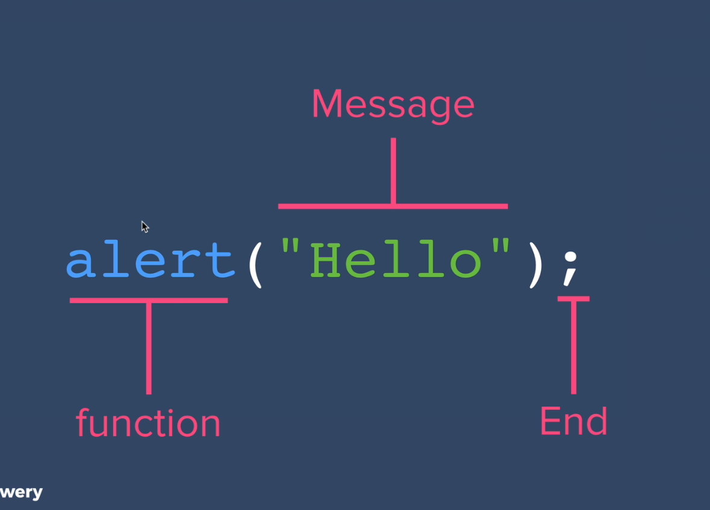

## Topic
In this section we will learn about Javascript. Javascript was created by `Brendan Eich`, this language can run on client side but also on server side.

It is Interpreted language not a complied language.

`ECMAScript` provide standard of Javascript. `ECMA` stands for European Computer Manufacture Association.

Javascript provide more intractability  when working with HTML. Most website now days depend on Javascript for its intractability and functionality. Javascript is one on the most used programming language.

There is a big different between `Java` and `JavaScript`. Java is complied language while Javascript is Interpreted language.

## Keywords & Notes
## Javascript Alerts Adding Behavior to Website

On this section we will starting adding behaviors using Javascript.

There are many ways to write Javascript code, you can use console on browser, snipping editor or code editor.

If you want to write multiple line of code using console, make sure you click `shift` then `enter` to add another line.

But the better way to write Javascript code on browser is to use `Snipping editor` which provide a way to write multiple line of code.

```
alert('Hello')
```
This is the first line of Javascript which we will start to learn, which will provide a pop up message on the screen.


The about shows the syntax of writing the `alert function`, syntax is the same as grammar in english language.

If you are wondering were does this code originated, you can check the documentation of it through [MDN](https://developer.mozilla.org/en-US/docs/Web/API/Window/alert), this website provide the documentation of the language, its methods, properties and other features of the language.

As you can see on `alert function` above we use `double quotes`. Javascript allow the use of `Single or double quotes`. But it is very important to have one way of writing your code, to make your code easy to read, but also having consistency way of writing  you're code.

> Check this to learn more on better way to write consistent Js
[Principles of Writing Consistent, Idiomatic JavaScript](https://github.com/rwaldron/idiomatic.js/)


## Summary