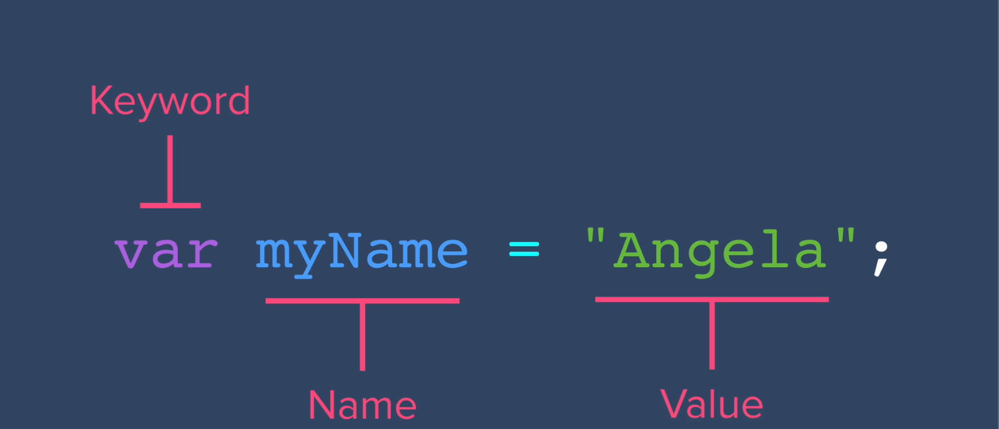
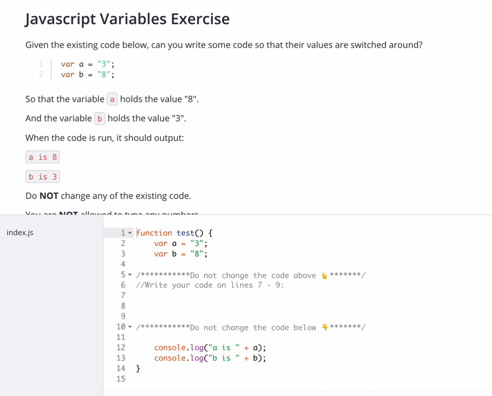
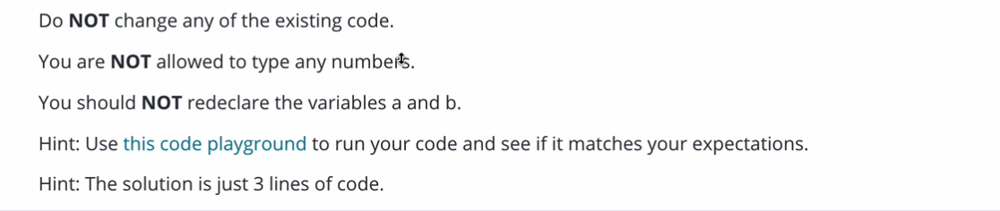

## Topic

In this section we will learn about Javascript. Javascript was created by `Brendan Eich`, this language can run on client side but also on server side.

It is Interpreted language not a complied language.

`ECMAScript` provide standard of Javascript. `ECMA` stands for European Computer Manufacture Association.

Javascript provide more intractability when working with HTML. Most website now days depend on Javascript for its intractability and functionality. Javascript is one on the most used programming language.

There is a big different between `Java` and `JavaScript`. Java is complied language while Javascript is Interpreted language.

[The difference btn Interpreters and Compilers](https://www.youtube.com/watch?v=_C5AHaS1mOA)

## Keywords & Notes

## Javascript Alerts Adding Behavior to Website

On this section we will starting adding behaviors using Javascript.

There are many ways to write Javascript code, you can use console on browser, snipping editor or code editor.

If you want to write multiple line of code using console, make sure you click `shift` then `enter` to add another line.

But the better way to write Javascript code on browser is to use `Snipping editor` which provide a way to write multiple line of code.

```
alert('Hello')
```

This is the first line of Javascript which we will start to learn, which will provide a pop up message on the screen.


The about shows the syntax of writing the `alert function`, syntax is the same as grammar in english language.

If you are wondering were does this code originated, you can check the documentation of it through [MDN](https://developer.mozilla.org/en-US/docs/Web/API/Window/alert), this website provide the documentation of the language, its methods, properties and other features of the language.

As you can see on `alert function` above we use `double quotes`. Javascript allow the use of `Single or double quotes`. But it is very important to have one way of writing your code, to make your code easy to read, but also having consistency way of writing you're code.

`Note`: Any string when written using Javascript must be `single or double` quoted

> Check this to learn more on better way to write consistent Js
> [Principles of Writing Consistent, Idiomatic JavaScript](https://github.com/rwaldron/idiomatic.js/)

## Data Types

Is the way to classify data to tell a computer how the program tend to use the data.

There are different data types in Javascript. The following are some of the data types which we will start with.

```
String - just string of characters. Example "Hello World"
Number - just numeric value. Example: 123
Boolean - true or false
```

The function `typeOf()`, can be used to check the data type of any data.

```
typeof(123)
//Expected output: number
typeof("Hello World")
//Expected output: string
```

## Javascript Variables
`Variable` is a way to commit/ store piece of data in the memory.

> Below is how the variable is defined and assigned a piece of data


> Example of variable
```
let myName = "joseph"
let yourName = prompt('What is your name')
alert(`My name is ${myName}, enjoy my notes ${yourName}`)

//Expected output:My name is joseph, enjoy my notes Peter
```

## Javascript Variable Exercise 

>Rule to solve the problem


>My try
```
function test() {
  var a = "3";
  var b = "8";

  //Don't change the code above
  let temp = a;
  a = b
  b = temp;

  //Don't change the code below
  console.log("a is " + a);
  console.log("b is " + b);
}


test()
//Expected output
a is 8
b is 3
```

## Javascript Variable Exercise Solution
> In Programming, Language Syntax is very easily, the hard/difficult part is setting up the logic.

```
function test() {
  var a = "3";
  var b = "8";

  //Don't change the code above
  var c = a;
  a = b
  b = c;

  //Don't change the code below
  console.log("a is " + a);
  console.log("b is " + b);
}


test()
//Expected output
a is 8
b is 3
```

## Naming and Naming Conventions for Javascript Variable

How to name variable, best practice
1. Give a variable a meaningfully name. Example getName, instead untitled123
2.You can't name a variable using reserved keyword. Example `var`, `let`, `const`, etc
3. You can't name a variable by beginning with a `number`, but a variable can contain a number. Example `123school` instead `school123`
4. Variable name can't contain space, no spaces. Example `my school`
5. Variable name can contain letters (`abc..`), dollar sign (`$`) and underscore (`_`), no any other symbol is valid to be used to name a variable. Example `my-name`

It's recommended to use `camel-case` when naming you variable.

## String Concatenation
This is the way of combining two or more string together to form a single string. You can achieve this by using `+` plus sign.

```
"a" + "" + "b" = ab
alert("Hello" + " " +  "World")
//Expected output: Hello World

let firstName = "Joseph"
let lastName = "Muganga"

alert(firstName + " " + lastName)
//Expected output: Joseph Muganga
```


## Summary
