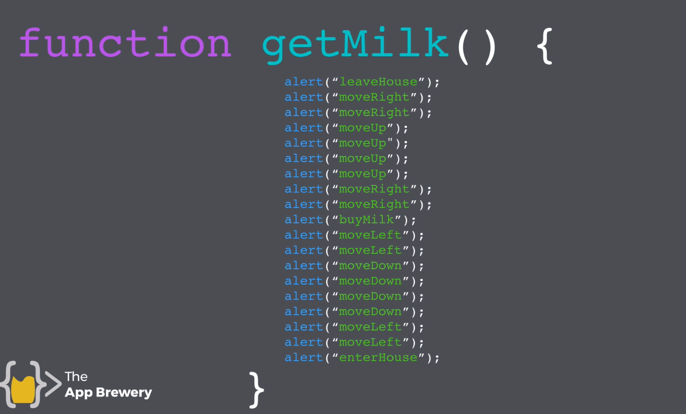
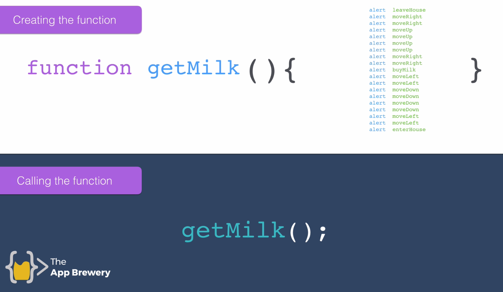
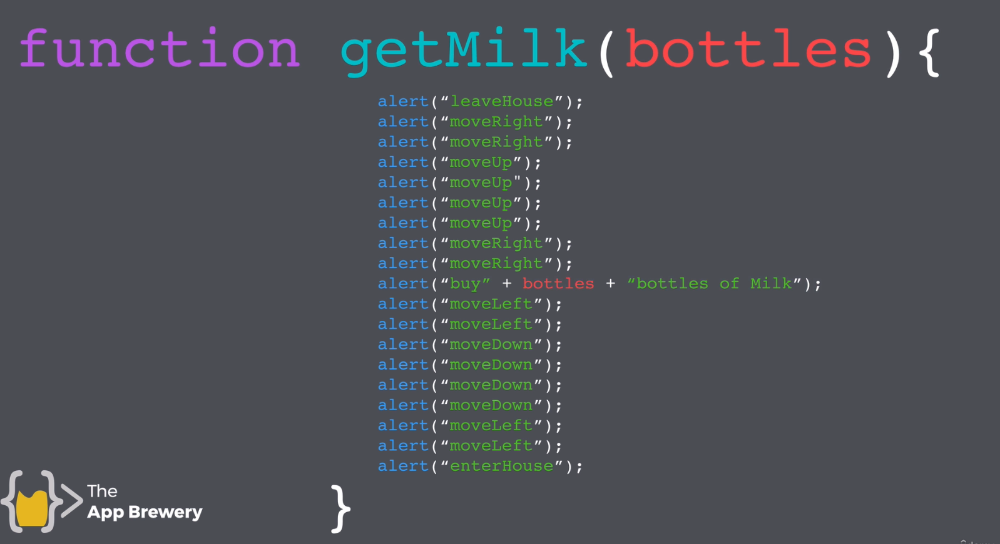
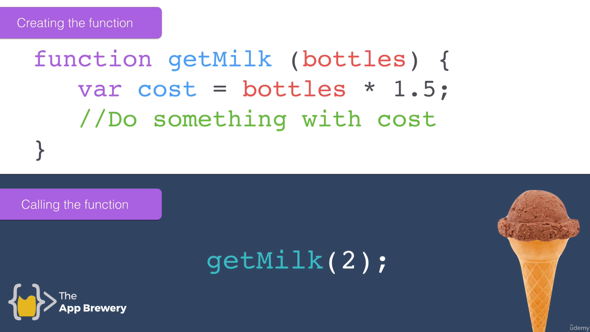
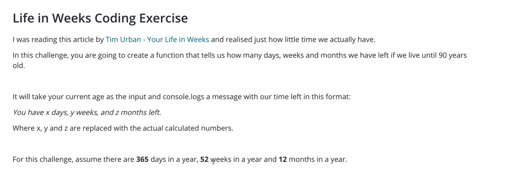
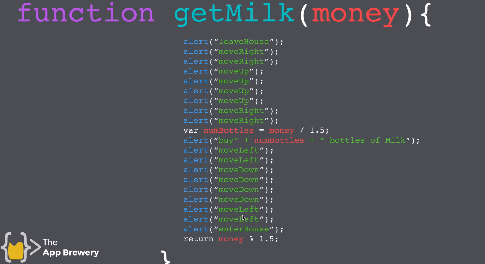
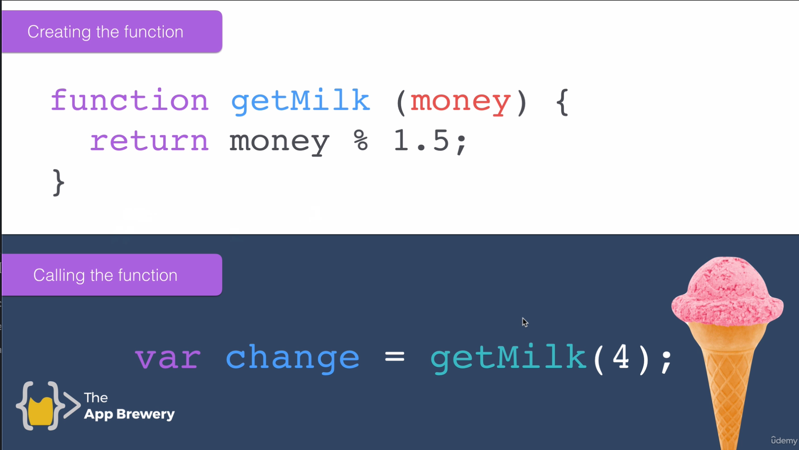
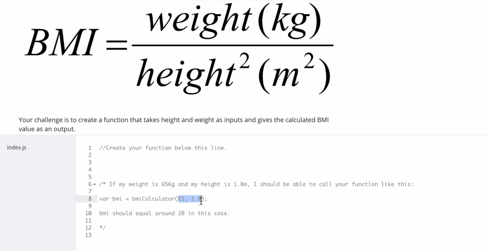

## Topic

In this section we will learn about Javascript. Javascript was created by `Brendan Eich`, this language can run on client side but also on server side.

It is Interpreted language not a complied language.

`ECMAScript` provide standard of Javascript. `ECMA` stands for European Computer Manufacture Association.

Javascript provide more intractability when working with HTML. Most website now days depend on Javascript for its intractability and functionality. Javascript is one on the most used programming language.

There is a big different between `Java` and `JavaScript`. Java is complied language while Javascript is Interpreted language.

[The difference btn Interpreters and Compilers](https://www.youtube.com/watch?v=_C5AHaS1mOA)

## Keywords & Notes

## Javascript Alerts Adding Behavior to Website

On this section we will starting adding behaviors using Javascript.

There are many ways to write Javascript code, you can use console on browser, snipping editor or code editor.

If you want to write multiple line of code using console, make sure you click `shift` then `enter` to add another line.

But the better way to write Javascript code on browser is to use `Snipping editor` which provide a way to write multiple line of code.

```
alert('Hello')
```

This is the first line of Javascript which we will start to learn, which will provide a pop up message on the screen.


The about shows the syntax of writing the `alert function`, syntax is the same as grammar in english language.

If you are wondering were does this code originated, you can check the documentation of it through [MDN](https://developer.mozilla.org/en-US/docs/Web/API/Window/alert), this website provide the documentation of the language, its methods, properties and other features of the language.

As you can see on `alert function` above we use `double quotes`. Javascript allow the use of `Single or double quotes`. But it is very important to have one way of writing your code, to make your code easy to read, but also having consistency way of writing you're code.

`Note`: Any string when written using Javascript must be `single or double` quoted

> Check this to learn more on better way to write consistent Js
> [Principles of Writing Consistent, Idiomatic JavaScript](https://github.com/rwaldron/idiomatic.js/)

## Data Types

Is the way to classify data to tell a computer how the program tend to use the data.

There are different data types in Javascript. The following are some of the data types which we will start with.

```
String - just string of characters. Example "Hello World"
Number - just numeric value. Example: 123
Boolean - true or false
```

The function `typeOf()`, can be used to check the data type of any data.

```
typeof(123)
//Expected output: number
typeof("Hello World")
//Expected output: string
```

## Javascript Variables

`Variable` is a way to commit/ store piece of data in the memory.

> Below is how the variable is defined and assigned a piece of data
> 

> Example of variable

```
let myName = "joseph"
let yourName = prompt('What is your name')
alert(`My name is ${myName}, enjoy my notes ${yourName}`)

//Expected output:My name is joseph, enjoy my notes Peter
```

## Javascript Variable Exercise


> Rule to solve the problem
> 

> My try

```
function test() {
  var a = "3";
  var b = "8";

  //Don't change the code above
  let temp = a;
  a = b
  b = temp;

  //Don't change the code below
  console.log("a is " + a);
  console.log("b is " + b);
}


test()
//Expected output
a is 8
b is 3
```

## Javascript Variable Exercise Solution

> In Programming, Language Syntax is very easily, the hard/difficult part is setting up the logic.

```
function test() {
  var a = "3";
  var b = "8";

  //Don't change the code above
  var c = a;
  a = b
  b = c;

  //Don't change the code below
  console.log("a is " + a);
  console.log("b is " + b);
}


test()
//Expected output
a is 8
b is 3
```

## Naming and Naming Conventions for Javascript Variable

How to name variable, best practice

1. Give a variable a meaningfully name. Example getName, instead untitled123
   2.You can't name a variable using reserved keyword. Example `var`, `let`, `const`, etc
2. You can't name a variable by beginning with a `number`, but a variable can contain a number. Example `123school` instead `school123`
3. Variable name can't contain space, no spaces. Example `my school`
4. Variable name can contain letters (`abc..`), dollar sign (`$`) and underscore (`_`), no any other symbol is valid to be used to name a variable. Example `my-name`

It's recommended to use `camel-case` when naming you variable.

## String Concatenation

This is the way of combining two or more string together to form a single string. You can achieve this by using `+` plus sign.

```
"a" + "" + "b" = ab
alert("Hello" + " " +  "World")
//Expected output: Hello World

let firstName = "Joseph"
let lastName = "Muganga"

alert(firstName + " " + lastName)
//Expected output: Joseph Muganga
```

## String Length and Retrieving the Number of Characters

Javascript String, have a property called `length` which give the number of characters that the string have.

Comment in Javascript

```
// - Is used for single line comment.
/* comment */ - Is used for multiple line comment.
```

```
let myName = 'Joseph'
console.log(myName.length)

//Expected output: 6
```

> Challenge: Write a program that will prompt a user to enter a string of character, the program will count the character and return how many number of character have been written, and how many characters left (frm 240 character)

```
//myTry
let characterWritten = prompt('Enter your message')
let characterLeft = 240 - characterWritten.length
console.log('You have written ' + characterWritten.length + ' characters' +  ',' + ' you have ' + characterLeft + ' characters left' )

//Expected output: You have written 109 characters, you have 131 characters left
```

## Slicing and Extracting Parts of a String

`slice(x,y`)` This function works with String variable. It is used to slice a string of characters.

> Syntax

```
let myName = 'Joseph`
myName.slice(0,1)
/*
*myName.slice(startPosition, endPosition)
*myName.slice(0,1)
* This means slice *myName* string starting from position 0 and end up without including positon 1, so the function will return `J`
*/

//Expected output: J
```

Always remember Programmers always start to count from position 0. If you want to know the number of character which will be return, what to do is take `UpperBound (endPosition) - lowerBound(startPosition), for our case (1-0) = 1, only one character will be returned.

> Challenge: Write a program which will prompt a user to enter a string of characters, then it will return an alert if the character exceed 140, and return the slice characters which have been trimmed.

```
//myTry
let myMessage = prompt('Enter your Message')
let messageLength = myMessage.length
let trimmedMessage = myMessage.slice(0,messageLength)
alert('This is trimmed message: ' + trimmedMessage)

// Short way of writing the above code.
alert( prompt('Enter your Message').slice(0,140))
```

## Challenging Changing Casing in Text

In Javascript, you can change the case of the word, the built in function you can use are `word.toLowerCase()` and `word.toUpperCase()`, all this function return a word with a changed case.

```
const name = 'Joseph'
const nameToLowerCase = name.toLowerCase()
const nameToUpperCase = name.toUpperCase()

console.log(nameToLowerCase)
console.log(nameToUpperCase)

//Expected outpu:
joseph
JOSEPH
```

`Challenge` Write a program which will prompt the user to enter his/her first name, then the program will return `Hello, firstName`, the value of firstName must start with the capital letter, example `Hello, Joseph`.

`My try`

```
const name = prompt("Please enter your first name") //joSEPH
//capitalize first character, after slice(0,1)
const firstCharName = name.slice(0,1).toUpperCase()
//lowercase to the rest of characters, after slice (1, name.length)
const theRestChar = name.slice(1,name.length).toLowerCase()
const capitalizedName = firstCharName + theRestChar
alert('Hello, ' + capitalizedName )

//Expected output
Hello, Joseph
```

## Basic Arithmetic and the Modulo Operator in Javascript

In Javascript it is possible to do arithmetic operations, the following are arithmetic operation that can be done in Javascript

```
//Addition
let a = 3 + 3
//Subtraction
let b = 10 - 2
//Multiplication
let c = 10 * 10
//Division
let d = 10/5
//Modulo - which return the remainder after division
let e = 10/3 // will retun 1
```

All the arithmetic operation are performed using the predefined precedence. For example Multiplication must be performed first before addition, etc, like BODMAS in mathematics, to simplify this use the brackets.

`Challenge` Write a program which will calculate the humanAge, the formula to use to calculate humanAge is `humanAGe = (dogAge - 2) * 4 + 21`, so the program will prompt the user to enter `dogAge` then it will calculate the `humanAge`.

`My try`

```
let dogAge = prompt('Enter your dog Age') //10
let humanAge = (dogAge - 2) * 4 + 21
alert('Your dog is ' + humanAge + ' years old in human years.');

//Expected output
Your dog is 53 years old in human years.
```

## Increment and Decrement Expression

So far we have been using arithmetic operation which is also common in mathematics. The Following are different way we can do arithmetic in Javascript

`Increment` - adding by 1 or any number

```
let x = 5
x = x + 1 // 6
```

`The above is the same as`

```
let x = 5
x++ //6
```

`Decrement` - substraction by 1 or any number

```
let y = 6
y = y - 1 // 5
```

`The above is the same as`

```
let y = 6
y-- //5
```

This is what we call increment and decrement in Javascript. This short form can also be used for `*,+,-,/`, multiplication, addition, subtraction and division.

`For example`

```
let s = 5
s = s * 5 //25
```

`The above is the same as`

```
let s = 5
s *= 5 //25
```

## Function Part 1 Creating and Calling Functions

`Function` is a way that allow to write a series of instruction and package it in a block of code, which tells a computer what to do/perform.

`OR in other words` Is a set by step instruction which tells the computer what to do. For example if you what to get milk from a store, you can write a function which tells the computer each step which must be performed in order to get milk from a store.



> Creating a function
> A function is creating by following a below syntax

```
function nameOfFunction (){
  // what to be performed
}
//function is a keyword which indicate this is a function
`
For Example
function getMilk(){
  //what to be performed
}
```

> Calling a function
> If you want to use the function, you are supposed to call it. Calling a function just write its name and parenthesis

```
getMilk()
```



> Tool to practice function
> [Stanford Karel](https://stanford.edu/~cpiech/karel/ide.html)

```
This is one of the solutions for the Karel Check Board Challenge, there are many ways of solving this problem, as long as you managed to achieve the pattern specified then you have succeeded!

function main(){
   beepersRight();
   goUpTurnLeft();
   beepersLeft();
   goUpTurnRight();
      beepersRight();
   goUpTurnLeft();
   beepersLeft();
   goUpTurnRight();
      beepersRight();
}

function goUpTurnRight() {
   turnRight();
   move();
   turnRight();
}

function goUpTurnLeft() {
   turnLeft();
   move();
   turnLeft();
}

function beepersRight() {
   putBeeper();
   move();
   move();
   putBeeper();
   move();
   move();
   putBeeper();
}

function beepersLeft() {
   move();
   putBeeper();
   move();
   move();
   putBeeper();
   move();
}
```

`Function` allow us to write code that is dry, meaning removing repetition by creating module of code, which make our code shorter and allow us to identify problems easier if does occurs.

> Note
> `console.log()` output, most of the time is not for the user but for the developer to identify problems or to figure some part of the code how it works

## Function Part 2 Parameters and Arguments
In Javascript, it is possible to write a function which will take an input. 


For example, from our previous example, we wrote a function which was able to getMilk(), now we can improve the function by providing how many bottle of milk should the function get.


## Life Weeks Coding Challenge


```
//My try to the Challenge
const lifeInWeeks = function (age){
  let yearsRemaining = 90 - age;
  let daysRemaining = Math.floor(yearsRemaining*365);
  let weeksRemaining = Math.floor(yearsRemaining*52);
  let monthRemaining = Math.floor(yearsRemaining*12);

  return `You have ${daysRemaining} days, ${weeksRemaining} weeks, and ${monthRemaining} months left`
}

console.log(lifeInWeeks(30))

//Expected output: You have 21900 days, 3120 weeks, and 720 months left
```

## Function part 3 Outputs and Return values
When writing functions, we can be able to return the value after the function process the inputs or after the function perform a certain task.


This return values can be stored on another variable or used on another function.For example on below function.


This can also improve or provide way to write dry code, with less repetition.

## Challenge Create a BMI Calculator


```
//My try
 const bmi = function(weight, height){
   return Math.round(weight/Math.pow(height,2));
   
 }

console.log(bmi(65,1.8))

//Expected output: 20

```


## Summary
